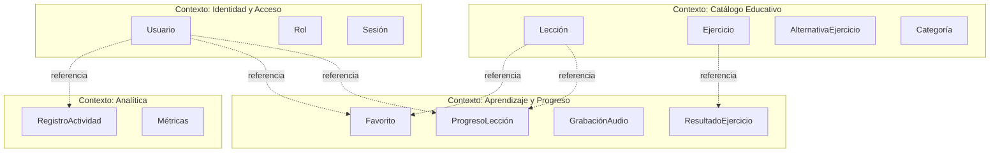

# Modelo de Dominio Conceptual — NixLang

> **Plataforma de Aprendizaje de Inglés para Hispanohablantes**
> Versión del Modelo: 1.0 · Junio 2025
> Basado en: Documentación de Producto V1, Requerimientos Funcionales (RF-001 a RF-047), Decisiones de Negocio (DN-001 a DN-007), Historias de Usuario (HU-001 a HU-139)

---

## 1. Lista de Entidades del Dominio

| #  | Entidad                    | Tipo                | Agregado al que pertenece  |
|----|----------------------------|---------------------|----------------------------|
| 1  | **Usuario**                | Entidad Raíz        | Agregado Usuario           |
| 2  | **Lección**                | Entidad Raíz        | Agregado Lección           |
| 3  | **Ejercicio**              | Entidad             | Agregado Lección           |
| 4  | **AlternativaEjercicio**   | Entidad             | Agregado Lección           |
| 5  | **Categoría**              | Entidad Raíz        | Agregado Categoría         |
| 6  | **ProgresoLección**        | Entidad Raíz        | Agregado Progreso          |
| 7  | **ResultadoEjercicio**     | Entidad             | Agregado Progreso          |
| 8  | **GrabaciónAudio**         | Entidad             | Agregado Progreso          |
| 9  | **RegistroActividad**      | Entidad             | Agregado Progreso          |
| 10 | **Favorito**               | Entidad Asociativa  | Asociación entre agregados |
| 11 | **LecciónCategoría**       | Entidad Asociativa  | Asociación entre agregados |

### Value Objects Identificados

| Value Object           | Descripción                                                   |
|------------------------|---------------------------------------------------------------|
| **NivelReferencial**   | Enumeración: `A1`, `A2`, `B1`, `B2`                          |
| **TipoEjercicio**      | Enumeración: `TRADUCCION`, `COMPLETAR_ESPACIOS`, `OPCION_MULTIPLE`, `PRONUNCIACION` |
| **EstadoProgreso**     | Enumeración: `NO_INICIADA`, `EN_PROGRESO`, `COMPLETADA`      |
| **TipoActividad**      | Enumeración: `INICIO_SESION`, `INICIO_LECCION`, `RESPUESTA_EJERCICIO`, `COMPLETAR_LECCION`, `AGREGAR_FAVORITO`, `QUITAR_FAVORITO` |
| **Rol**                | Enumeración: `USUARIO`, `ADMINISTRADOR`                       |
| **CorreoElectrónico**  | Cadena validada con formato de email, única en el sistema     |
| **Contraseña**         | Cadena almacenada como hash seguro                            |

---

## 2. Descripción de Cada Entidad

### 2.1 Usuario

Persona registrada en la plataforma NixLang. Puede desempeñar el rol de **usuario regular**, quien consume el contenido educativo y registra su avance, o de **administrador**, responsable de gestionar y organizar dicho contenido.

### 2.2 Lección

Unidad pedagógica principal de la plataforma. Representa un contenido educativo estructurado que el usuario puede iniciar, realizar y completar libremente, sin necesidad de haber completado otras lecciones previamente. Contiene un conjunto ordenado de ejercicios y puede pertenecer a múltiples categorías temáticas.

### 2.3 Ejercicio

Actividad individual dentro de una lección. Existen cuatro modalidades: traducción español→inglés, completar espacios en blanco, opción múltiple y pronunciación por audio. Cada ejercicio presenta un enunciado y una respuesta esperada que permite evaluar el desempeño del usuario.

### 2.4 AlternativaEjercicio

Opción de respuesta disponible para ejercicios de tipo **opción múltiple**. Cada alternativa puede ser correcta o incorrecta, y solo tiene sentido en el contexto de un ejercicio de esta modalidad.

### 2.5 Categoría

Agrupación temática que permite organizar y clasificar las lecciones del catálogo. Una categoría puede contener múltiples lecciones, y una lección puede pertenecer a múltiples categorías simultáneamente.

### 2.6 ProgresoLección

Representa el avance de un usuario en una lección específica. Captura el estado del progreso (no iniciada, en progreso, completada), el porcentaje de avance y las fechas relevantes. Un usuario puede realizar la misma lección múltiples veces, generando registros de progreso independientes por cada intento.

### 2.7 ResultadoEjercicio

Registra el desempeño obtenido por un usuario al responder un ejercicio concreto dentro de un intento de lección. Almacena la respuesta proporcionada, si fue correcta o incorrecta, y el momento en que se produjo.

### 2.8 GrabaciónAudio

Representa un archivo de audio capturado por el usuario durante un ejercicio de pronunciación. Queda asociado al usuario, al ejercicio y al intento de progreso correspondiente.

### 2.9 RegistroActividad

Captura eventos relevantes de uso de la plataforma con fines analíticos. Cada entrada refleja qué acción realizó un usuario, sobre qué recurso, y en qué momento. Alimenta las métricas y estadísticas de uso del sistema.

### 2.10 Favorito

Representa la marcación de una lección como favorita por parte de un usuario. Permite que cada usuario mantenga una lista personalizada de lecciones de su interés, pudiendo agregar o quitar favoritos libremente en cualquier momento.

### 2.11 LecciónCategoría

Representa la asociación entre una lección y una categoría temática. Permite que una lección pertenezca a múltiples categorías y que una categoría agrupe múltiples lecciones, facilitando la organización y el descubrimiento del contenido educativo.

---

## 3. Atributos Principales

### 3.1 Usuario

| Atributo           | Tipo              |
|--------------------|-----------------  |
| `id`               | Identificador     |
| `nombre`           | Texto             |
| `correoElectrónico`| CorreoElectrónico |
| `contraseña`       | Contraseña        |
| `rol`              | Rol               |
| `fechaRegistro`    | FechaHora         |

### 3.2 Lección

| Atributo              | Tipo              |
|------------------------|------------------|
| `id`                   | Identificador    |
| `título`               | Texto            |
| `descripción`          | Texto            |
| `nivelReferencial`     | NivelReferencial |
| `estado`               | EstadoPublicación|
| `fechaCreación`        | FechaHora        |
| `fechaActualización`   | FechaHora        |

### 3.3 Ejercicio

| Atributo             | Tipo            |
|----------------------|-----------------|
| `id`                 | Identificador   |
| `tipo`               | TipoEjercicio   |
| `enunciado`          | Texto           |
| `respuestaCorrecta`  | Texto           |
| `orden`              | Entero          |
| `recursoAudioUrl`    | URL             |

> **📝 NOTA:** La `respuestaCorrecta` aplica para ejercicios de tipo `TRADUCCION` y `COMPLETAR_ESPACIOS`. Para `OPCION_MULTIPLE`, la corrección se define a través de sus alternativas. Para `PRONUNCIACION`, la evaluación puede seguir criterios distintos.

### 3.4 AlternativaEjercicio

| Atributo        | Tipo          |
|-----------------|---------------|
| `id`            | Identificador |
| `texto`         | Texto         |
| `esCorrecta`    | Booleano      |
| `orden`         | Entero        |

### 3.5 Categoría

| Atributo       | Tipo          |
|----------------|---------------|
| `id`           | Identificador |
| `nombre`       | Texto         |
| `descripción`  | Texto         |

### 3.6 ProgresoLección

| Atributo              | Tipo            |
|-----------------------|-----------------|
| `id`                  | Identificador   |
| `estado`              | EstadoProgreso  |
| `porcentajeAvance`    | Decimal         |
| `fechaInicio`         | FechaHora       |
| `fechaFinalización`   | FechaHora       |

### 3.7 ResultadoEjercicio

| Atributo            | Tipo          |
|---------------------|---------------|
| `id`                | Identificador |
| `respuestaDada`     | Texto         |
| `esCorrecta`        | Booleano      |
| `fechaRespuesta`    | FechaHora     |

### 3.8 GrabaciónAudio

| Atributo            | Tipo          |
|---------------------|---------------|
| `id`                | Identificador |
| `archivoUrl`        | URL           |
| `fechaGrabación`    | FechaHora     |

### 3.9 RegistroActividad

| Atributo          | Tipo          |
|-------------------|---------------|
| `id`              | Identificador |
| `tipoActividad`   | TipoActividad |
| `referenciaId`    | Identificador |
| `fechaHora`       | FechaHora     |

### 3.10 Favorito

| Atributo          | Tipo          |
|-------------------|---------------|
| `id`              | Identificador |
| `fechaMarcación`  | FechaHora     |

### 3.11 LecciónCategoría

| Atributo          | Tipo          |
|-------------------|---------------|
| `id`              | Identificador |

---

## 4. Relaciones entre Entidades

### 4.1 Mapa de Relaciones

| #  | Entidad Origen       | Relación                                | Entidad Destino  | Cardinalidad |
|----|----------------------|-----------------------------------------|------------------|:------------:|
| R1 | Lección              | *contiene*                              | Ejercicio        | 1 : N        |
| R2 | Ejercicio            | *tiene alternativas*                    | AlternativaEjercicio | 1 : N        |
| R3 | Lección              | *clasificada en (vía LecciónCategoría)* | Categoría        | N : M        |
| R4 | Usuario              | *marca como favorita (vía Favorito)*    | Lección          | N : M        |
| R5 | Usuario              | *registra progreso en*                  | Lección (vía ProgresoLección) | N : M (con atributos) |
| R6 | ProgresoLección      | *contiene resultados de*                | ResultadoEjercicio | 1 : N        |
| R7 | ResultadoEjercicio   | *corresponde a*                         | Ejercicio        | N : 1        |
| R8 | Usuario              | *genera*                                | GrabaciónAudio   | 1 : N        |
| R9 | Ejercicio            | *recibe grabaciones de*                 | GrabaciónAudio   | 1 : N        |
| R10| Usuario              | *genera*                                | RegistroActividad | 1 : N        |

### 4.2 Descripción Detallada de Relaciones

#### R1 — Lección ↔ Ejercicio `[1 : N]`
Una lección **contiene** uno o más ejercicios, los cuales se presentan de manera secuencial dentro de ella. Un ejercicio **pertenece** de forma exclusiva a una única lección.

#### R2 — Ejercicio ↔ AlternativaEjercicio `[1 : N]`
Un ejercicio de opción múltiple **tiene** dos o más alternativas. Al menos una de estas alternativas debe ser la correcta. Las alternativas existen únicamente ligadas al ejercicio correspondiente.

#### R3 — Lección ↔ Categoría (vía LecciónCategoría) `[N : M]`
Una lección **puede pertenecer** a una o más categorías temáticas, y una categoría **puede agrupar** múltiples lecciones, relacionándose a través de la entidad asociativa **LecciónCategoría**. Una lección puede no tener categorías asociadas, y una categoría puede no contener lecciones.

#### R4 — Usuario ↔ Lección (vía Favorito) `[N : M]`
Un usuario **puede marcar** múltiples lecciones como favoritas, y una lección **puede ser marcada** como favorita por múltiples usuarios, relacionándose a través de la entidad asociativa **Favorito** que documenta la fecha de dicha marcación.

#### R5 — Usuario ↔ Lección (Progreso) `[N : M con atributos]`
Un usuario **registra su progreso** al realizar una lección, pudiendo completarla en múltiples intentos independientes. Cada intento de lección genera un registro de **ProgresoLección** único que vincula al usuario con la lección correspondiente.

#### R6 — ProgresoLección ↔ ResultadoEjercicio `[1 : N]`
Un registro de **ProgresoLección** **contiene** los resultados individuales de cada ejercicio respondido durante ese intento. Cada **ResultadoEjercicio** pertenece de forma exclusiva a un único progreso de lección.

#### R7 — ResultadoEjercicio ↔ Ejercicio `[N : 1]`
Cada **ResultadoEjercicio** **corresponde** a un ejercicio específico de la lección. Un mismo ejercicio puede ser evaluado en múltiples resultados a través de diferentes intentos de progreso.

#### R8 y R9 — Usuario / Ejercicio ↔ GrabaciónAudio `[1 : N]`
Un usuario **genera** una **GrabaciónAudio** al realizar un ejercicio de pronunciación. Cada grabación pertenece a un único usuario y está asociada a un ejercicio de pronunciación específico.

#### R10 — Usuario ↔ RegistroActividad `[1 : N]`
Un usuario **genera** registros de actividad que representan sus interacciones y eventos relevantes dentro de la plataforma. Cada **RegistroActividad** está vinculado a un único usuario.

---

## 5. Cardinalidades — Resumen Visual

```
Usuario  ──── 1 : N ────  ProgresoLección
Usuario  ──── N : M ────  Lección           (vía Favorito)
Usuario  ──── 1 : N ────  GrabaciónAudio
Usuario  ──── 1 : N ────  RegistroActividad

Lección  ──── 1 : N ────  Ejercicio
Lección  ──── N : M ────  Categoría         (vía LecciónCategoría)

Ejercicio ─── 1 : N ────  AlternativaEjercicio  (solo tipo OPCION_MULTIPLE)
Ejercicio ─── 1 : N ────  GrabaciónAudio        (solo tipo PRONUNCIACION)

ProgresoLección ── 1 : N ── ResultadoEjercicio
ResultadoEjercicio ── N : 1 ── Ejercicio
```

---

## 6. Reglas de Negocio Asociadas

### 6.1 Reglas sobre Usuario

| ID    | Regla                                                                                         | Origen       |
|-------|-----------------------------------------------------------------------------------------------|--------------|
| RN-01 | El correo electrónico debe ser único en el sistema; no pueden existir dos usuarios con el mismo correo. | RF-001       |
| RN-02 | Al registrarse, el rol por defecto es `USUARIO`. Solo un administrador puede asignar el rol `ADMINISTRADOR`. | RF-038, HU-098 |
| RN-03 | Un usuario no autenticado no puede acceder a funcionalidades privadas (catálogo personalizado, progreso, favoritos). | RF-037       |
| RN-04 | Las sesiones deben gestionarse de forma segura, con expiración controlada.                     | RF-039       |
| RN-05 | Solo usuarios con rol `ADMINISTRADOR` pueden crear, editar o eliminar lecciones, ejercicios y categorías. | RF-026, RF-038 |

### 6.2 Reglas sobre Lección

| ID    | Regla                                                                                         | Origen       |
|-------|-----------------------------------------------------------------------------------------------|--------------|
| RN-06 | Una lección debe tener al menos título, descripción y nivel referencial.                       | RF-007, RF-027 |
| RN-07 | El nivel referencial es orientativo, **no constituye una barrera de acceso**. Cualquier usuario puede acceder a cualquier lección sin restricciones de prerrequisitos. | DN-007, RF-010 |
| RN-08 | Una lección puede pertenecer a múltiples categorías simultáneamente.                           | DN-003, RF-033.1 |
| RN-09 | Al eliminar una lección, se deben eliminar en cascada sus ejercicios y datos asociados, según las reglas de integridad definidas. | HU-079       |
| RN-10 | Un administrador debe confirmar la eliminación de una lección antes de ejecutarla.             | HU-078       |
| RN-11 | Una lección puede tener estados de publicación: borrador, publicada o desactivada temporalmente. | HU-133 a HU-136, RF-046 |

### 6.3 Reglas sobre Ejercicio

| ID    | Regla                                                                                         | Origen       |
|-------|-----------------------------------------------------------------------------------------------|--------------|
| RN-12 | Todo ejercicio debe estar asociado a exactamente una lección.                                  | RF-030, HU-084 |
| RN-13 | Los ejercicios deben tener un tipo definido (`TRADUCCION`, `COMPLETAR_ESPACIOS`, `OPCION_MULTIPLE`, `PRONUNCIACION`). | RF-015 a RF-018 |
| RN-14 | Los ejercicios de tipo `OPCION_MULTIPLE` deben tener al menos dos alternativas, con al menos una marcada como correcta. | RF-017       |
| RN-15 | Las respuestas deben ser validadas automáticamente por el sistema de forma inmediata tras ser enviadas. | RF-019, HU-040 |
| RN-16 | El sistema debe proporcionar retroalimentación indicando si la respuesta fue correcta o incorrecta, y mostrar la respuesta correcta en caso de error. | RF-020, HU-042 a HU-044 |
| RN-17 | Un administrador debe confirmar la eliminación de un ejercicio antes de ejecutarla.            | HU-090       |
| RN-18 | Los ejercicios se navegan secuencialmente dentro de una lección (avanzar y retroceder).        | RF-013, HU-024, HU-025 |

### 6.4 Reglas sobre Categoría

| ID    | Regla                                                                                         | Origen       |
|-------|-----------------------------------------------------------------------------------------------|--------------|
| RN-19 | El nombre de la categoría debe ser único en el sistema.                                        | RF-033       |
| RN-20 | Una categoría puede existir sin lecciones asociadas.                                           | RF-033       |
| RN-21 | Al eliminar una categoría, se debe desasociar de las lecciones vinculadas, no eliminar las lecciones. | Inferido     |

### 6.5 Reglas sobre Progreso y Resultados

| ID    | Regla                                                                                         | Origen       |
|-------|-----------------------------------------------------------------------------------------------|--------------|
| RN-22 | El progreso se registra individualmente por usuario.                                           | DN-006       |
| RN-23 | Un usuario puede realizar la misma lección múltiples veces, generando registros de progreso independientes. | DN-005       |
| RN-24 | El porcentaje de avance se calcula automáticamente en función de la cantidad de ejercicios respondidos sobre el total de la lección. | RF-024       |
| RN-25 | Una lección se marca como `COMPLETADA` cuando el usuario ha respondido todos sus ejercicios.   | RF-014, RF-023 |
| RN-26 | El estado de una lección para un usuario es `NO_INICIADA`, `EN_PROGRESO` o `COMPLETADA`.       | RF-046       |
| RN-27 | El sistema debe registrar la actividad del usuario de forma automática, sin requerir acción adicional. | RF-021, HU-049 |
| RN-28 | Se debe almacenar la fecha y hora de cada actividad y resultado.                                | HU-048       |

### 6.6 Reglas sobre Favoritos

| ID    | Regla                                                                                         | Origen       |
|-------|-----------------------------------------------------------------------------------------------|--------------|
| RN-29 | Un usuario puede marcar múltiples lecciones como favoritas.                                    | DN-001       |
| RN-30 | Una lección puede ser marcada como favorita por múltiples usuarios.                            | DN-002       |
| RN-31 | El sistema debe indicar visualmente cuándo una lección está marcada como favorita por el usuario actual. | RF-045       |
| RN-32 | Un usuario puede agregar y quitar favoritos libremente en cualquier momento.                   | RF-042, RF-043 |

### 6.7 Reglas sobre Audio

| ID    | Regla                                                                                         | Origen       |
|-------|-----------------------------------------------------------------------------------------------|--------------|
| RN-33 | Las grabaciones de audio solo se capturan cuando un ejercicio de pronunciación lo requiere.     | RF-035       |
| RN-34 | Las grabaciones realizadas por los usuarios deben ser almacenadas de forma persistente.         | RF-036       |

---

## 7. Diagrama UML de Dominio

```mermaid
classDiagram
    direction TB

    class Usuario {
        +id : UUID
        +nombre : String
        +correoElectrónico : CorreoElectrónico
        +contraseña : Contraseña
        +rol : Rol
        +fechaRegistro : FechaHora
    }

    class Lección {
        +id : UUID
        +título : String
        +descripción : String
        +nivelReferencial : NivelReferencial
        +estado : EstadoPublicación
        +fechaCreación : FechaHora
        +fechaActualización : FechaHora
        +cantidadEjercicios() int
    }

    class Ejercicio {
        +id : UUID
        +tipo : TipoEjercicio
        +enunciado : String
        +respuestaCorrecta : String
        +orden : int
        +recursoAudioUrl : String
        +validarRespuesta(respuesta) bool
    }

    class AlternativaEjercicio {
        +id : UUID
        +texto : String
        +esCorrecta : bool
        +orden : int
    }

    class Categoría {
        +id : UUID
        +nombre : String
        +descripción : String
    }

    class ProgresoLección {
        +id : UUID
        +estado : EstadoProgreso
        +porcentajeAvance : Decimal
        +fechaInicio : FechaHora
        +fechaFinalización : FechaHora
        +calcularAvance() Decimal
        +finalizar() void
    }

    class ResultadoEjercicio {
        +id : UUID
        +respuestaDada : String
        +esCorrecta : bool
        +fechaRespuesta : FechaHora
    }

    class GrabaciónAudio {
        +id : UUID
        +archivoUrl : String
        +fechaGrabación : FechaHora
    }

    class RegistroActividad {
        +id : UUID
        +tipoActividad : TipoActividad
        +referenciaId : UUID
        +fechaHora : FechaHora
    }

    class Favorito {
        +id : UUID
        +fechaMarcación : FechaHora
    }

    class LecciónCategoría {
        +id : UUID
    }

    class NivelReferencial {
        &lt;&lt;enumeration&gt;&gt;
        A1
        A2
        B1
        B2
    }

    class TipoEjercicio {
        &lt;&lt;enumeration&gt;&gt;
        TRADUCCION
        COMPLETAR_ESPACIOS
        OPCION_MULTIPLE
        PRONUNCIACION
    }

    class EstadoProgreso {
        &lt;&lt;enumeration&gt;&gt;
        NO_INICIADA
        EN_PROGRESO
        COMPLETADA
    }

    class TipoActividad {
        &lt;&lt;enumeration&gt;&gt;
        INICIO_SESION
        INICIO_LECCION
        RESPUESTA_EJERCICIO
        COMPLETAR_LECCION
        AGREGAR_FAVORITO
        QUITAR_FAVORITO
    }

    class Rol {
        &lt;&lt;enumeration&gt;&gt;
        USUARIO
        ADMINISTRADOR
    }

    Lección "1" *-- "1..*" Ejercicio : contiene
    Ejercicio "1" *-- "0..*" AlternativaEjercicio : tiene alternativas

    Lección "0..*" -- "0..*" Categoría : clasificada en
    (Lección, Categoría) .. LecciónCategoría

    Usuario "0..*" -- "0..*" Lección : marca favorita
    (Usuario, Lección) .. Favorito

    Usuario "1" -- "0..*" ProgresoLección : registra
    Lección "1" -- "0..*" ProgresoLección : tiene progreso

    ProgresoLección "1" *-- "0..*" ResultadoEjercicio : contiene
    ResultadoEjercicio "0..*" -- "1" Ejercicio : corresponde a

    Usuario "1" -- "0..*" GrabaciónAudio : genera
    Ejercicio "1" -- "0..*" GrabaciónAudio : recibe

    Usuario "1" -- "0..*" RegistroActividad : genera

    Lección -- NivelReferencial
    Ejercicio -- TipoEjercicio
    ProgresoLección -- EstadoProgreso
    RegistroActividad -- TipoActividad
    Usuario -- Rol
```

---

## 8. Bounded Contexts (Contextos Delimitados)

Desde la perspectiva de Domain-Driven Design, el modelo de NixLang se organiza en los siguientes contextos delimitados:



| Contexto                     | Responsabilidad                                                       | Entidades principales                  |
|------------------------------|-----------------------------------------------------------------------|----------------------------------------|
| **Identidad y Acceso**       | Registro, autenticación, autorización y gestión de perfil de usuarios | Usuario, Rol, Sesión                   |
| **Catálogo Educativo**       | Gestión y organización del contenido pedagógico                       | Lección, Ejercicio, AlternativaEjercicio, Categoría |
| **Aprendizaje y Progreso**   | Ejecución de lecciones, registro de avance, favoritos y resultados    | ProgresoLección, ResultadoEjercicio, GrabaciónAudio, Favorito |
| **Analítica**                | Registro de eventos y generación de métricas de uso                   | RegistroActividad, Métricas            |

---

## 9. Agregados (Aggregates)

| Agregado               | Raíz del Agregado | Entidades Internas                       | Invariantes Clave                                                |
|-------------------------|--------------------|------------------------------------------|------------------------------------------------------------------|
| **Agregado Usuario**    | Usuario            | —                                        | Email único, rol válido                                          |
| **Agregado Lección**    | Lección            | Ejercicio, AlternativaEjercicio          | Al menos un ejercicio, ejercicios ordenados, alternativas válidas para opción múltiple |
| **Agregado Categoría**  | Categoría          | —                                        | Nombre único                                                     |
| **Agregado Progreso**   | ProgresoLección    | ResultadoEjercicio, GrabaciónAudio       | Estado consistente con ejercicios respondidos, porcentaje calculado correctamente |

> **💡 TIP:** Las relaciones N:M (Favoritos y LecciónCategoría) se modelan como asociaciones entre agregados. No pertenecen a un agregado específico, sino que son gestionadas por servicios de dominio dedicados.

---

## 10. Trazabilidad RF → Entidades

| RF        | Descripción                        | Entidades Involucradas                           |
|-----------|------------------------------------|--------------------------------------------------|
| RF-001    | Registro de Usuario                | Usuario                                          |
| RF-002    | Inicio de Sesión                   | Usuario                                          |
| RF-005    | Gestión de Perfil                  | Usuario                                          |
| RF-006    | Visualización de Lecciones         | Lección, Categoría                               |
| RF-007    | Detalle de Lección                 | Lección, Ejercicio                               |
| RF-009    | Filtrado de Lecciones              | Lección, Categoría                               |
| RF-010    | Acceso Libre a Lecciones           | Lección                                          |
| RF-011    | Inicio de Lección                  | ProgresoLección, Lección                         |
| RF-012    | Visualización de Ejercicios        | Ejercicio, Lección                               |
| RF-014    | Finalización de Lección            | ProgresoLección                                  |
| RF-015    | Ejercicios de Traducción           | Ejercicio                                        |
| RF-016    | Ejercicios Completar Espacios      | Ejercicio                                        |
| RF-017    | Ejercicios Opción Múltiple         | Ejercicio, AlternativaEjercicio                  |
| RF-018    | Ejercicios de Pronunciación        | Ejercicio, GrabaciónAudio                        |
| RF-019    | Validación de Respuestas           | Ejercicio, ResultadoEjercicio                    |
| RF-020    | Retroalimentación                  | ResultadoEjercicio                               |
| RF-021    | Registro de Actividad              | RegistroActividad                                |
| RF-022    | Registro de Resultados             | ResultadoEjercicio                               |
| RF-023    | Registro Lecciones Completadas     | ProgresoLección                                  |
| RF-024    | Visualización de Progreso          | ProgresoLección                                  |
| RF-027    | Creación de Lecciones              | Lección                                          |
| RF-030    | Creación de Ejercicios             | Ejercicio, Lección                               |
| RF-033    | Gestión de Categorías              | Categoría                                        |
| RF-033.1  | Asociación de Categorías           | Lección, Categoría (LecciónCategoría)            |
| RF-035    | Grabación de Audio                 | GrabaciónAudio, Ejercicio, Usuario               |
| RF-038    | Control de Roles                   | Usuario                                          |
| RF-040    | Estadísticas de Uso                | RegistroActividad                                |
| RF-042–45 | Favoritos                          | Usuario, Lección (Favorito)                      |
| RF-046    | Estado de Lección por Usuario      | ProgresoLección                                  |
| RF-047    | Lecciones por Categoría            | Lección, Categoría                               |
